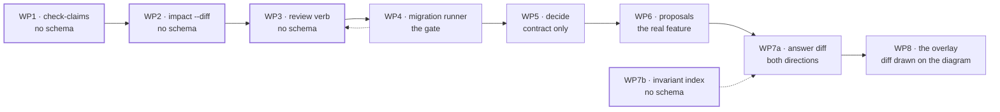

# Implementation plan — the design and review half

> Sequences [design-and-review-loop.md](design-and-review-loop.md) into seven work packages.
> Nothing here is in `roadmap.yaml` yet; §9 says exactly what promoting it would cost.
>
> The order is not the proposal's order. Three of its six gaps are cheaper than it estimates, one
> is built on a mechanism that does not exist, and the schema migration it mentions in a single
> sentence is the gate for half the list.

## 0 · Before any of it

Two premises of the proposal have moved since it was written, and both change what step one is.

**The MCP server is already wired.** `main-panel/.mcp.json` registers `veriflow` → `apps/cli/src/main.ts
mcp C:/…/main-panel`, alongside playwright and the two Supabase servers. The proposal's §9 item 1 is
done.

**The data behind it is stale.** `main-panel/.veriflow/veriflow.db` was last written on 2026-08-01 at
00:24, at commit `5fc5be6` on `feature/022-payment-integrity`. Every tool served through that entry
answers from a tree state that predates the 023 spec.

So step zero is not a feature and not a config edit:

```
veriflow index main-panel
veriflow verify main-panel          # all six answers, against HEAD
```

And then the part that is free and was skipped: `veriflow ask` for the four flows 023 touches that
have no stored answer — *lesson paid → tax document issued*, *wallet top-up → document issued*,
*reconcile sweep issues missing documents*, *tier gate on issuing*. The proposal's own argument is
that asking about the refund flow is what puts the two credit-note call sites side by side. None of
the seven packages below is worth starting before that has been tried, because every one of them is
an instrument and there is very little to point it at.

## 1 · The order, and why it is this one



Three rules produced this sequence.

**Zero-schema work goes first.** WP1, WP2, WP3 and WP7b touch no table. They can ship in any order,
in any week, and none of them can corrupt a 125 MB database holding six answers that D2 says are not
reproducible.

**The migration is a gate, not a chore.** Before WP4 the schema was one DDL string at version 1, the
store's constructor threw on any mismatch, and `restoreDump` threw on the same one. Nothing that adds
a column could land before WP4, and everything from WP5 onwards adds one. *(Shipped — the gate is
open.)*

**Value per line decides the rest.** WP1 pays off on every spec, issue and ADR already in
`main-panel` on the day it lands. WP6 is the feature the proposal is actually about and cannot be
reached in under a fortnight.

| WP | Ships | Schema | Size | Blocks |
|---|---|---|---|---|
| 1 | `veriflow check-claims <doc.md>` | none | ~250 lines + tests | — |
| 2 | `veriflow impact [path] [--diff <ref>]`, `get_change_impact` | none | ~200 lines + tests | — |
| 3 | `veriflow review <id> --accept\|--reopen`, browser button | none | ~80 lines + tests | — |
| 4 | schema v2, additive, with a backup and a rebuild | **v1 → v2** | ~150 lines + tests | 5, 6, 7a |
| 5 | `veriflow decide <id> <qid>` | contract field only | ~200 lines + tests | — |
| 6 | `veriflow propose <id>`, `kind`, `intent` citations, proposed modules | uses v2 | ~1000 lines + tests | 7a |
| 7 | `veriflow diff` as-is↔proposal↔built, `veriflow invariants` | none | ~400 lines + tests | 8 |
| 8 | the diff drawn **on** the diagram, SVG and browser | none | ~350 lines + tests | — |

---

## 2 · WP1 — `veriflow check-claims` · **shipped**

> Built on 2026-08-02: `packages/answers/src/claims.ts`, `locate`/`hashLine` exported from
> `verification.ts`, the CLI verb, and `tests/f012-claims.test.ts` — 28 cases, whole suite 439 green,
> typecheck clean. Three things changed under contact with a real document; all are marked below.

**Ships.** `veriflow check-claims specs/023-invoicing-module/spec.md [path] [--since <ref>] [--json]`.
Reads a markdown document, extracts every `file.ts:123` claim, re-locates each one in the tree as it
is now, and prints `resolved · drifted · missing · file-missing · unanchored` with the same ladder
`veriflow verify` prints. Writes nothing, to the document or to the database.

### The mechanism the proposal assumes does not exist

§5 of the proposal says `check-claims` would have caught `generateLessonTaxDocument.ts:225`
"because the line hash no longer matches". A hand-written spec has no stored line hash. Handed a bare
`path:line`, `verifyCitation` returns exactly the useless answer, at
`packages/answers/src/verification.ts:217`:

> `drifted`, confidence `low` — *"no recorded line hash and no symbol — the file changed, but there is
> no anchor to locate this citation with"*

Forty claims would all come back as low-confidence drift. So the whole of WP1's design is the anchor,
and the verifier underneath it is reused untouched.

### Three anchors, in order

1. **Git-anchored.** Resolve a baseline ref, `git show <ref>:<path>`, and hash the cited line *as it
   read there* with the existing `hashLine` (`packages/answers/src/verification.ts:104`). That is precisely the line hash
   the proposal wants — computed rather than stored — and it feeds `locate()`
   (`packages/answers/src/verification.ts:142`) unchanged, so a moved line is reported with its new number and its
   distance. This is the pass that catches the `:225` case.
2. **Symbol from the prose.** No baseline, or the file did not exist at it: take a backticked
   identifier from the same sentence or list item and use `locate()`'s existing symbol pass.
3. **Neither.** Report `unanchored`. The file exists and is long enough, and nothing else can be
   said. Not a fabricated `drifted` — D19's rule, applied to an instrument that would otherwise lie
   in forty places at once.

Free checks that need no anchor at all, and catch most rot on their own: the file is gone; the line
is past the end of the file; the file has changed since the baseline.

**Default baseline.** The commit that last touched the document — `git log -1 --format=%H -- <doc>`.
A spec's claims were true when it was written, and that is the tree state to compare against.
`--since` overrides it, and an untracked document falls back to **HEAD**, then to the snapshot. The
chosen ref and the reason for it are printed above the results, because a comparison against an
unstated baseline is not a measurement.

> **Changed during implementation.** This section originally put the snapshot ahead of HEAD, and the
> first dogfood run showed why that is wrong: measured against an index three commits old, a claim on
> line 1046 of the CLI relocated to 1167 when the line was in fact at 1126. The baseline was a
> tree state neither the author nor the reader ever had. HEAD is where an untracked document was
> almost certainly written; the snapshot is now the last resort.

### Extraction

Matches `` `path.ts:123` `` and bare `path.ts:123`, plus `:100-120` ranges and `#L123`. Recognition
and judgement are two steps, deliberately: anything with a letter in the path is **recognised**, and
what cannot then be checked is reported with a reason. A clock time, a ratio and a URL have no
letters or no standalone existence and are silently ignored — listing them would bury the rejections
a reader has to act on — while `makefile:12` and an absolute path are named. Nothing recognised is
ever dropped in silence: a claim checker that quietly discards what it cannot parse reports a
coverage it does not have.

**Shorthand resolution, added during implementation.** Prose does not repeat full paths. A document
that has already named `packages/answers/src/corrections.ts` goes on to write `corrections.ts:45`,
and the first dogfood run reported twelve such shorthands as *"gone or was renamed"* — a false report
in the one place this tool has to be trusted. Paths are now resolved against the indexed file list by
unique suffix match: one match is used and the shorthand is shown next to it, several is reported as
ambiguous with the candidates named, none is reported as unmatched. `file-missing` is now reserved
for a path the index knows and the disk does not, which is a real deletion.

### Files

| File | Change |
|---|---|
| `packages/answers/src/claims.ts` | new — extraction, anchor resolution, `checkClaims()` |
| `packages/answers/src/verification.ts` | export `locate` and `hashLine`, currently module-private |
| `packages/answers/src/index.ts` | re-export |
| `apps/cli/src/main.ts` | `check-claims` command, printing like `verify` at `:800` |
| `tests/f012-claims.test.ts` | new |

Deliberately **not** a new package: `locate()` and the ladder stay in one place, for the reason
`freshness.ts` already gives about two implementations eventually disagreeing. Deliberately **not**
persisted either — no `SPEC_CHECKS`/`SPEC_CLAIMS`, against §7 of the proposal. A check is a property
of a tree state, cheap to repeat, and persisting it would drag the most valuable gap behind WP4 for
no reader who has asked for the history.

### Acceptance

- A claim whose line moved is reported `drifted` with the line it moved to, not with a shrug.
- A claim quoting a defect that has since been fixed reports `missing` when the line is gone, and
  `drifted` with the new position when it merely moved.
- A claim with no anchor of any kind is reported `unanchored`, never `drifted`.
- The baseline ref and how it was chosen are printed before any result.
- Extracted-but-unparseable candidates are counted and named; the summary states claims found,
  checked and skipped as three separate numbers.
- The document is not modified, and nothing is written to the database — asserted by a test.
- The outcome vocabulary and the drift window are the same ones `veriflow verify` prints.

### Tests

- extraction over backticked, bare, ranged and `#L` forms, plus the `node:crypto` / URL / clock-time
  rejections;
- a claim that resolved, one that drifted inside the window, one that drifted beyond it, one whose
  line is gone, one whose file is gone;
- git-anchored against a baseline where the line read differently, asserting the new position;
- symbol-anchored with no usable baseline;
- unanchored, asserting it is not reported as drift;
- an untracked document falling back to the snapshot commit, with the fallback stated;
- a document with no claims at all;
- no-write assertion over the document and the store;
- Windows path separators in claims against a POSIX-separator index.

---

## 3 · WP2 — `veriflow impact --diff` · **shipped**

> Built on 2026-08-02: `packages/answers/src/diff-impact.ts`, the `impact` CLI verb in both forms,
> `get_change_impact` on the read surface, and `tests/f013-diff-impact.test.ts` — 21 cases, whole
> suite 460 green, typecheck clean. **The algorithm below was wrong and was replaced**; see the
> correction.

**Ships.** `veriflow impact <path>` (CLI parity with a tool that until now only existed over MCP and
in the browser) and `veriflow impact --diff <ref>`: the changed hunks between `<ref>` and `HEAD`,
mapped onto the stored answers whose citations land inside them. Plus `get_change_impact` on the read
surface, because the agent doing the review is the reader who needs it.

### Smaller than the proposal says, and independent of WP6

§6's G5 bundles hunk impact with plan-vs-built and calls the pair *medium*. The hunk half alone is
small and depends on nothing: `impactOf` (`packages/answers/src/project.ts:235`) already returns
`lines: number[]` per answer per file, next to `lineState`. The work is a diff parser and an
intersection.

### The one thing that has to be right

**A hunk range and a stored citation line are not in the same coordinate system.** Citations were
recorded against their own answer's snapshot commit. `git diff <ref>...HEAD` produces ranges in
`<ref>` space on the left and `HEAD` space on the right. Intersecting a stored line with either is
sound only when the answer's snapshot happens to be that ref, which for six answers taken at
`5fc5be6` and a review at HEAD it never will be.

> **This paragraph was wrong, and the first real run proved it.** It said: relocate each citation
> into the working tree, then intersect with the diff's **new-side** ranges. Run against `main-panel`
> and six months of stored answers, that reported **zero hits against a hundred and eighty hunks** —
> the single most dangerous answer this command can give.
>
> The reason is a contradiction. Relocation matches the hash of the cited line, so any citation it
> can place is one whose content did *not* change; and a citation whose content *did* change cannot
> be placed at all. Intersecting on the new side therefore looks for changed lines among exactly the
> lines that are guaranteed not to have changed.
>
> **The intersection belongs on the base-ref side.** A hunk's old-side range is what the change
> removed or replaced; a citation inside it is evidence that was edited. Citations are put into
> base-ref coordinates — free when the answer's snapshot *is* the base ref, which is the ordinary
> case of reviewing against the indexed commit, and a `locate()` into the ref's copy of the file
> otherwise. Where the line is *now* is reported alongside, because that is what the reader opens.
> After the fix the same run reports edited, adjacent and deleted evidence, including a citation on
> `reconcileLessonPayments.ts:97` whose line the change removed outright.

Citations that cannot be placed in the base ref are reported as such rather than counted as
unaffected — the difference between "this change does not touch that flow" and "we could not tell"
is the whole value of the command. Each hit says what happened to it: `edited`, `deleted`,
`adjacent` (new code written directly against it), or `file-deleted`.

**Two more things the first run exposed.** `git diff` only sees tracked files, so a file created and
never added was invisible — a review that silently omits the new files is worse than one that lists
them without hunks, so untracked files are included as whole-file additions, filtered through the
same `.veriflowignore` resolver every other path entering VeriFlow goes through. And an answer that
cites a changed file where no hunk lands on a cited line is reported in a separate `nearby` list
rather than dropped: the flow runs through code that moved, which is a reason to look and not a
reason to act, and merging the two lists would make the first one mean less.

Renames are followed with `git diff -M --find-renames`, mapping old path to new before the lookup;
a citation into a renamed file otherwise vanishes from the impact of the commit that renamed it,
which is the exact moment somebody needs it.

### Files

| File | Change |
|---|---|
| `packages/answers/src/diff-impact.ts` | new — hunk parsing, rename map, relocation, intersection |
| `packages/answers/src/index.ts` | re-export |
| `apps/cli/src/main.ts` | `impact` command, both forms |
| `packages/mcp-server/src/read-server.ts` | `get_change_impact`, standard envelope |
| `tests/f013-diff-impact.test.ts` | new |

Read-only, and a read tool over MCP rather than a write one — §10 of the proposal bans architecture
*writes* over MCP, not reads.

### Acceptance

- A hunk overlapping a cited line names the answer, the step, and the line, with the answer's review
  state and freshness.
- Citation positions are relocated into working-tree coordinates before intersecting, and the output
  says that is what happened.
- A citation that can no longer be located is reported as unplaceable, never silently as unaffected.
- A renamed file's citations follow the rename.
- A diff touching nothing any answer cites says nobody has asked about these files, not that nothing
  depends on them — the same wording `get_impact` already uses.
- `veriflow impact <path>` and `get_impact` return the same facts for the same file.
- No provider call, no run, no write.

### Tests

- hunk parsing over add-only, delete-only, mixed and zero-context (`--unified=0`) diffs;
- a hunk that overlaps a cited line, one that abuts it, one that misses it by a line;
- an answer whose citations relocated before intersecting, asserting the relocated position is used;
- an unplaceable citation, asserted as its own category;
- a rename, with citations following;
- an empty result, with its wording asserted;
- `get_change_impact` over a real MCP client, with the envelope.

---

## 4 · WP3 — the review verb · **shipped**

> Built on 2026-08-02: `veriflow review <id> --accept|--reopen [--yes] [--json]`,
> `POST /answers/:id/review` and `POST /api/answers/:id/review`, the control on the answer screen,
> and `tests/f014-review-and-decide.test.ts` — 9 cases, whole suite 469 green, typecheck clean.
> Exercised end to end on `main-panel`: an answer went to `reviewed` and back, which is the first
> time in the product's life that label has said anything.

**Ships.** `veriflow review <answerId> --accept | --reopen [path]`, and the same as a button on the
answer screen. That is all. `Store.setReviewState` has existed since F005 at
`packages/store/src/index.ts:937` and only a test has ever called it.

### Why `--note` is not in this package

The obvious home for a review note is `answer_corrections`, and it does not fit. `EDITABLE` at
`packages/answers/src/corrections.ts:45` permits exactly one field on an answer — `title` — so a
correction carrying a note lands in `unresolvedCorrections` and is served to every reader as *a
correction whose target is no longer in this answer*. It would be visible, wrong, and on the envelope.

The honest home is three columns on `answers`, and those need WP4.

### The half-truth this package ships with, deliberately

A `review_state` with no record of the tree state it was given at is the same defect the proposal
complains about in §6 G4: a label that carries no information at the moment an agent is deciding how
much to trust it. Accepting an answer that is already `stale` records `reviewed` and forgets that.

Two things keep it honest until WP4: the CLI prints the freshness and the fingerprint at the moment
of review and requires confirmation when the state is `stale` or `broken` (it does not refuse — D12
labels, it does not gate); and WP4's first migration adds `reviewed_at`, `reviewed_by` and
`review_fingerprint` and backfills nothing, so an answer reviewed before WP4 reads as reviewed at an
unknown tree state rather than pretending otherwise.

On `main-panel` that confirmation earns its place immediately. Every one of the six answers is
`stale` after six commits, so accepting one is exactly the case where a silent write would record a
judgement nobody knowingly made:

```
b739e2a6  Vyrovnání již existující rezervace z interního kreditu …
  STALE    at least one citation no longer locates
  measured from file hashes · fingerprint 3220634ed085b19e
  Accept anyway? [y/N]
```

The browser shows the same fact as a warning pill beside the button rather than disabling it, and a
test asserts the control is offered rather than gated.

### Files

| File | Change |
|---|---|
| `apps/cli/src/main.ts` | `review` command |
| `apps/server/src/index.ts` | `POST /api/answers/:id/review` |
| `apps/server/src/views.ts` | accept / reopen control on the answer screen |
| `tests/f014-review-and-decide.test.ts` | new, shared with WP5 |

### Acceptance

- `--accept` sets `reviewed`, `--reopen` sets `unreviewed`, and every MCP envelope reflects it
  immediately.
- Reviewing an answer whose freshness is `stale` or `broken` prints the state and the rule, and asks
  for confirmation.
- The freshness and fingerprint at the moment of review are printed.
- The browser control and the CLI verb go through one store method — asserted.
- No note, no author, and the command says both are coming with the schema version rather than
  accepting and dropping them.

### Tests

- accept, reopen, and accept again; the envelope after each;
- confirmation path on a stale answer, and on a fresh one where none is asked;
- the browser route and the CLI reaching the same row;
- an unknown answer id failing with the same message shape as `verify`.

---

## 5 · WP4 — the migration runner · **shipped**

> Built on 2026-08-02: `MIGRATIONS` and the runner in `packages/store/src/index.ts`,
> `SCHEMA_VERSION = 2`, `restoreDump` taught to migrate, and `tests/f001-store-migration.test.ts` —
> 14 cases over a hand-written v1 schema, whole suite 483 green, typecheck clean.
>
> **Rehearsed on a copy of the real thing.** `main-panel`'s 125 MB database — 6 answers, 1,055
> citations, 1,300 verification results, 2,145 run events — was copied to a scratch directory and
> migrated there. 1.3 seconds, every row count identical across eleven tables, citation values
> preserved field by field, and the backup opened as a complete schema-1 database with `line` still
> `NOT NULL`. The original was not touched.

**Ships.** `SCHEMA_VERSION = 2`, an ordered `MIGRATIONS` list applied inside a transaction on open,
a backup taken before the first one, and `restoreDump` taught to migrate rather than throw.

### Why it is a gate

Before this package, the store's constructor executed one DDL string and then threw if
`meta.schemaVersion` disagreed by any amount, and `restoreDump` threw on the same mismatch.
`main-panel`'s database is
125 MB and holds six answers, nine verifications and 1,055 citations that an agent run cannot
reproduce (D2). "Delete it and re-index" is available for everything derived from the tree and
available for none of that.

So: **additive only**, in a transaction, with a row-count assertion after each step, and a copy of
`veriflow.db` to `veriflow.db.v1.bak` before the first migration on any given database. On a
125 MB file that is a second and it is the cheapest insurance in the plan.

**Two things the implementation had to get right that this section did not say.**

*The backup is taken with `VACUUM INTO`, not by copying the file.* The connection is open and in WAL
mode, so a byte copy of the main file can miss everything still sitting in the log — which would
make the insurance policy the least trustworthy file in the directory. `VACUUM INTO` writes a
consistent database from the open connection. Verified: the backup of the real database opens as a
complete schema-1 store, 1,055 citations, with `line` still `NOT NULL`.

*The version chain is checked for gaps, not just for direction.* The first cut selected every
migration between the stored version and `SCHEMA_VERSION` and applied what it found. Given a gap —
`SCHEMA_VERSION = 3` with only a step to 2 written — it would have applied that step, stamped the
version it reached, and handed back a database that is neither the old shape nor the new one. The
runner now requires an unbroken chain from where the database is to where the build expects it, or
it refuses and touches nothing.

### Everything v2 adds, in one go

Batching is deliberate: a second migration is much cheaper once the runner exists, but a second
*rebuild* of `answer_citations` is not.

```sql
-- WP3 / G4 — review provenance
ALTER TABLE answers ADD COLUMN reviewed_at TEXT;
ALTER TABLE answers ADD COLUMN reviewed_by TEXT;
ALTER TABLE answers ADD COLUMN review_note TEXT;
ALTER TABLE answers ADD COLUMN review_fingerprint TEXT;

-- WP6 / G1 — the proposal
ALTER TABLE answers ADD COLUMN kind TEXT NOT NULL DEFAULT 'observed';
ALTER TABLE answers ADD COLUMN intent INTEGER NOT NULL DEFAULT 0;

-- WP6 / G1 — the intent citation: needs a table rebuild, see below
```

`answer_citations.line` was `INTEGER NOT NULL`, and an intent citation has
no line. SQLite cannot relax a `NOT NULL` with `ALTER`, so this one step is a rebuild: create the new
shape, copy, drop, rename — with `PRAGMA foreign_keys = OFF` around it, since the table references
`answers(id)`, and with the pragma restored and a row count asserted before commit. It is the only
genuinely risky statement in the plan and it is the reason for the backup.

`module_id TEXT` and `planned_path TEXT` arrive in the same rebuild.

### Files

| File | Change |
|---|---|
| `packages/store/src/index.ts` | `MIGRATIONS`, the runner, the backup, `SCHEMA_VERSION = 2` |
| `packages/export/src/dump.ts` | restore an older dump by migrating after load, instead of throwing at `:114` |
| `tests/f001-store-migration.test.ts` | new |

### Acceptance

- Opening a v1 database migrates it to v2 and every existing row survives — asserted by count per
  table, before and after.
- A backup of the v1 file exists before the first migration and is named in the output.
- Opening a database written by a *newer* schema still refuses, with the existing message.
- A migration that throws leaves the database at v1 — the transaction rolls back and the file opens
  afterwards.
- `answer_citations` after the rebuild has the same rows, the same primary key, and a nullable `line`.
- A v1 dump restores into a v2 build, and the migration is reported rather than silent.
- Nothing in the migration re-derives anything from the repository.

### Tests

- v1 fixture → v2, per-table row counts;
- the rebuild specifically: primary key, foreign key, row count, and a nullable `line` accepting NULL;
- a deliberately failing migration rolling back;
- a future-version database still refusing;
- v1 dump restored into v2;
- reopening an already-migrated database as a no-op.

---

## 6 · WP5 — `veriflow decide` · **shipped**

> Built on 2026-08-03: `decision` on `OpenQuestionSchema`
> (`packages/flow-answer/src/contract.ts:86`), `decideQuestion` in
> `packages/answers/src/decide.ts:51`, and eleven cases added to
> `tests/f014-review-and-decide.test.ts` — whole suite 494 green, typecheck clean. No migration was
> needed and none was taken.
>
> **Rehearsed on a copy of the real thing.** `main-panel`'s `cd1557a2` — *Zrušení rezervace lekce a
> vrácení peněz zákazníkovi*, the answer whose count reads 4 — was decided on a scratch copy. `oq3`,
> the hard-coded 24-hour cancellation deadline, was settled with an author and a rationale; the count
> read 3 on the CLI list, the question kept its text on the paths screen and in the export with the
> decision beneath it, and the project screen's aggregate fell from 19 to 18. Deciding it a second
> time under a different name stored both rows and served the later one. The original database was
> not touched.

**Ships.** `veriflow decide <answerId> <questionId> --decision "…" --rationale "…" --author "…"`.
A human CLI verb, not an MCP write tool — §10 of the proposal, kept.

### The collision the proposal does not see

§6's G2 says `answer_corrections` "has the right shape". It has the right columns and the wrong
target. `EDITABLE` allowed exactly one field on an open question — `question`
(`corrections.ts:61-69`) — and `applyCorrections` writes it in place at `corrections.ts:83` into the
answer every surface serves (`read.ts:99`). Recording a decision that way **overwrites the question
text**: `get_open_questions` would return the decision where the question used to be, and the
question would be gone from the browser, the export and the MCP surface at once.

### The cheap correct path

One optional field on the contract:

```ts
// packages/flow-answer/src/contract.ts:86
export const OpenQuestionSchema = z.object({
  …
  decision: z.string().optional(),
});
```

`EDITABLE["open-question"]` gains `decision`. The decision is written as a correction row, so the
author, the timestamp and the rationale come from the columns `answer_corrections` already has —
`author`, `created_at`, `note` — and no `decidedBy`/`decidedAt` need to exist on the contract at all.
Old `body_json` rows parse unchanged, because the field is optional. **No migration, no new table**,
and D13's attribution survives intact.

Q5 stays untouched: closing a question amends no step and adds no claim.

### The ripple that must not be missed

`answerEnvelope` reported open questions from the stored column, and that column counts *all*
questions. Left alone, this package ships the exact failure the proposal names — *"next quarter the
open-question count on that answer will still read 4"*. The count has to mean *undecided* everywhere.

**This section said four call sites. There were nine.** The four it named are the ones that hold a
parsed answer; the rest hold a database row and never parse a body, which is a different problem with
a different fix.

Where the corrected answer is in hand, `undecidedQuestions(answer)` counts it directly
(`packages/answers/src/read.ts:68`) — the envelope (`read.ts:200`), `list_flow_answers`
(`read-server.ts:170`), the answer page's header pill, and the project screen, which drops a decided
question from the aggregate entirely (`packages/answers/src/project.ts:166`) rather than counting it.

Where only a row is in hand, parsing every `body_json` to render a list would be the wrong trade, so
the count travels with the row: `DECIDED_QUESTIONS` (`packages/store/src/index.ts:126`) is a
correlated subquery over `answer_corrections` added to `listAnswers` and `searchAnswers`, and
`undecidedInRow` (`read.ts:77`) subtracts it. That covers the CLI's `answers` list
(`apps/cli/src/main.ts:810`), the browser's answers screen (`views.ts:791`), `search_answers`
(`read-server.ts:648`) and `answersFromRun`, which is what the CLI and the run console both print
after a run (`packages/ask/src/start.ts:117`).

Two derivations, and they have to agree. What makes them agree is that `decide` refuses a question id
the answer does not have, so a decision row always has something to decide; the subquery counts
*distinct* ids, so deciding twice closes one question; and `undecidedInRow` clamps at zero, so a
correction row inserted by some other path can make the count stale but never negative. There is a
test asserting the two land on the same number.

`readBody` on the project screen was also not applying corrections at all — so that screen showed the
agent's original question text while the answer's own page showed a person's rewrite of it. Fixed
here because filtering on `decision` requires the corrected body anyway.

### Files

| File | Change |
|---|---|
| `packages/flow-answer/src/contract.ts` | optional `decision` on `OpenQuestionSchema` |
| `packages/answers/src/corrections.ts` | `decision` in `EDITABLE`; `decisionsOf` reads the attribution back |
| `packages/answers/src/decide.ts` | new — `decideQuestion`, so the verb is testable and the CLI is a printer |
| `packages/answers/src/read.ts` | `undecidedQuestions`, `undecidedInRow`, envelope counts undecided |
| `packages/answers/src/project.ts` | corrected bodies; aggregated open questions exclude decided |
| `packages/store/src/index.ts` | `decided_questions` on the list queries; corrections ordered by `created_at, rowid` |
| `packages/mcp-server/src/read-server.ts` | `get_open_questions` returns the decision, its author and its rationale |
| `packages/ask/src/start.ts` | `answersFromRun` reports undecided |
| `packages/export/src/markdown.ts` | the decision under the question it settles, with who and when |
| `apps/cli/src/main.ts` | `decide` command; `answers` list says undecided, and how many were decided |
| `apps/server/src/views.ts` | decided questions rendered with rationale and author |
| `tests/f014-review-and-decide.test.ts` | extended, 11 cases |

### Acceptance

- A decided question keeps its text, gains a decision, an author, a timestamp and a rationale, and
  says all five wherever it is shown.
- Every open-question count in the product means *undecided* — envelope, MCP tool, CLI list, project
  screen — asserted at each.
- A decision is a correction row: attributed, timestamped, and visible as a human edit.
- Deciding twice records both, and the latest is served.
- The MCP surface can read a decision and cannot write one — asserted by the absence of the tool.
- An answer stored before this package parses unchanged.

### Tests

- decide, then read through the envelope, the MCP tool, the CLI and the project view;
- the count is `undecided` at all four;
- decide twice, latest served, both stored;
- an old `body_json` with no `decision` field parsing;
- a decision on an unknown question id failing without writing;
- the correction row's author and note surviving into every read surface.

Plus three the section did not ask for and the implementation earned: the two derivations of
*undecided* agreeing on an answer where every question is decided; the row count clamping at zero
rather than going negative when a decision names a question the answer does not have; and an empty
decision or an unsigned one being refused — a decision nobody signed is not a decision, and the
attribution is the only thing this feature stores that the answer body does not.

---

## 7 · WP6 — proposals

The feature the proposal is actually about, and the only package here measured in weeks. It needs
WP4, and it touches almost every package, which is why it is sixth rather than first.

**Ships.** `veriflow propose <answerId> "<what should change>"` — an F004 session seeded with the
parent answer, producing a second answer with `kind = 'proposed'`, whose citations may be `intent`:
anchored to a module id and a planned path rather than to a line that does not exist yet.

### Scope

- `answers.kind` = `observed | proposed`, from WP4; `parent_answer_id` already threads it.
- `CitationState` (`packages/flow-answer/src/verify.ts:5`) gains `intent`.
- `CitationSchema` gains optional `moduleId` and `plannedPath`, with a refinement: a citation carries
  either a line or a module id, never neither.
- **A proposed module is a first-class thing** — see below. `LaneSchema.moduleId` may name a module
  the registry does not have yet, and the lane says so.

### A module that does not exist yet

The first draft of this package required every intent citation to name *a module id from the current
registry*. That criterion would have made the whole package useless for the feature the proposal is
written against: 023's headline change is four near-duplicate pipelines collapsing into **one new
module, `src/modules/invoicing`**, which by definition has no registry entry, because
`deriveModules` derives the registry from the paths of indexed symbols and there are none.

It needs no new identity mechanism, and that is a consequence of D18 rather than a lucky break.
Module ids are a pure function of the path — `moduleIdFromPath` at
`packages/callgraph/src/modules.ts:58`, applied to the root that `RULES` (`:22`) matches. So the id of a
module that does not exist can be computed from its planned path by the same function that will
compute it once the code lands: `src/modules/invoicing/issue.ts` resolves to `src-modules-invoicing`
before the file exists and after it, identically. **A proposal's module becomes real without anything
being re-pointed.** Implementation is exposing the rule matcher — `moduleRootForPath(path)`, five
lines out of `deriveModules` — so both callers share one derivation, for the reason the registry
already gives about two rules disagreeing about who owns a path.

A proposed module is then a derived id, a planned path, and a `proposed: true` flag on the lane. It
appears on the module map as a node the registry does not have, drawn as proposed (WP8), and it is
excluded from coverage exactly as a superseded answer is — a module nobody has built explains
nothing.
- `verifyCitations` skips intent citations rather than failing them, and counts them as their own
  number. The verified ratio's denominator excludes them — an answer that is nine tenths plan is not
  an answer that is nine tenths wrong, which is the reading the credit answer's 39 unverified
  citations get today.
- A proposal's review states reuse what exists: **a reviewed proposal is an accepted one**. No third
  value on `review_state`; §8's `accepted` is `kind='proposed'` plus `review_state='reviewed'`.
- `submit_flow_answer` in `packages/mcp-server/src/run-server.ts` accepts `kind`, and refuses
  `intent` citations on an observed answer.
- `packages/ask` gains the proposal prompt: same FlowAnswer contract, the parent answer as evidence,
  the instruction that a step with no code yet cites its module.

### Everything downstream that assumes a citation resolves to a file

Each of these needs an explicit decision, and each is a place where a proposal would otherwise be
measured as a broken observation:

| Site | What it must do |
|---|---|
| `freshness.ts` `fileStates` | exclude intent citations from the file set |
| `verification.ts` `entryPathsOf` | an intent entry step contributes no path |
| `verification.ts` `verifyAnswer` | intent citations are not re-located |
| `answers/metrics.ts` | metrics cover observed citations only, and say so |
| `project.ts` `impactOf` | a proposal is not coverage; it is shown and labelled, like a superseded answer |
| `export` | a proposal exports with its intent citations marked as intent |
| browser + `list_flow_answers` | `kind` on every listing, never inferred from the ratio |

### Files

Roughly: `flow-answer/contract.ts`, `flow-answer/verify.ts`, `flow-answer/validate.ts`,
`answers/{read,freshness,verification,metrics,project}.ts`, `mcp-server/{run,read}-server.ts`,
`ask/`, `export/`, `apps/server/src/views.ts`, `apps/cli/src/main.ts`, `tests/f015-proposals.test.ts`.

### Acceptance

- A proposal is stored with `kind='proposed'` and its parent, and no intent citation is ever counted
  as unverified.
- The verified ratio's denominator excludes intent citations, and the intent count is displayed
  beside it.
- An intent citation names a module — one that exists, or one derived from a planned path by the
  same function the registry uses. A citation that names neither a line nor a module is a structural
  fault, not a label.
- A proposed module carries its derived id, its planned path and a proposed flag; when the code
  lands, `deriveModules` produces the identical id with nothing re-pointed — asserted by a test that
  derives the id before and after creating the files.
- A proposed module contributes no coverage on the project screen, and is labelled wherever shown.
- An observed answer carrying an intent citation is refused at submit.
- Freshness, metrics, impact and export each state how they treat a proposal.
- A reviewed proposal is an accepted one; no third review state exists.
- Nothing enforces a proposal against the code. There is no rule file, no gate and no CI —
  asserted by the absence of any such surface.

### Tests

- submit a proposal with mixed observed and intent citations; ratio, counts, states;
- an intent citation with neither a line nor a module, refused;
- an intent citation on an observed answer, refused;
- a proposed module's id derived from a planned path, then the same id derived by `deriveModules`
  after the files exist — asserted equal;
- a proposed module excluded from coverage and labelled in the project view;
- freshness, metrics and impact over an answer that is half intent;
- export round-trip preserving intent;
- parent threading, and `ask --supersedes` turning a built proposal into an ordinary answer;
- the review path: proposed → reviewed, read back as accepted.

---

## 8 · WP7 — the answer diff, and the invariant index

### 7a · the answer diff, in both directions

**Two pairs, not one.** The first draft of this section specced only *proposal versus built* — the
backward-looking question, *did we build what we planned?* The forward-looking one is the pair that
gets used far more often, and it is stage 6 of the proposal's own design loop:

| Pair | Question | When |
|---|---|---|
| as-is → proposal | what would change, and what new modules appear | **before** the spec is written |
| proposal → built | did we build what we planned | after implementation |
| as-is → built | what actually changed | after, without a proposal |

All three are the same computation. `veriflow diff <a> <b>` already takes two answer ids
(`apps/cli/src/main.ts:1327`); what this package adds is that the pair may now be an observation and
a proposal, and that the output is framed by which pair it is.

**The matcher is the work.** The proposal calls this "`diffAnswers` unchanged, given a proposal as
the left-hand side". It is not, and the reason is one line: `diffAnswers` pairs steps by identity,
`before.get(id)` / `after.get(id)`, at `packages/answers/src/verification.ts:413-425`. That is
correct for its designed subject — the same question re-answered by `ask --supersedes`, where step
ids carry over. Two independent runs share no step ids, so every step would report as lost and every
step as gained.

So 7a is a **step matcher**, and the diff behind it is genuinely reused. Matching on lane, phase
ordinal, position and label similarity, with the pairing shown and its confidence stated, because a
diff whose pairing is wrong is worse than none. Unmatched steps on either side are the interesting
output — *planned and not built*, *built and not planned*, or, on the forward pair, *added by this
design* and *removed by this design*.

The forward pair also diffs the structure the backward pair can take for granted: lanes added,
lanes removed, **modules that do not exist yet**, and module edges that would be new. That list is
the architectural summary of a feature before anyone writes a task for it.

Needs WP6. ~300 lines and its own tests over hand-built pairs.

### 7b · `veriflow invariants` and `get_invariants`

Read-only, no schema, and independent of everything above — it could ship any time WP1–WP3 could. It
is placed last for the reason §6 G6 gives: it is the item most likely to drift toward the findings
engine the brief rules out, and doing it last means doing it with the rest of the loop already
visible.

An index over stored strings: group `branches[].invariant` across live answers by normalised text,
return the answers and branches asserting each, with each one's freshness. No checker, no score, no
health number — §10, kept. `main-panel/docs/architecture/invariants.md` is the hand-written version
of the same idea and is the obvious thing to compare the output against on day one.

~150 lines, `packages/answers/src/invariants.ts`, one MCP tool, one page.

### Acceptance (both)

- All three pairs — as-is→proposal, proposal→built, as-is→built — run through one matcher and one
  diff, and the output names which pair it is.
- Every pairing shows how it was matched and how confident the match is.
- Steps matched on neither side are reported per pair in that pair's own words.
- The forward pair lists lanes, modules and module edges added and removed, with modules that do not
  exist yet marked as such.
- `get_invariants` returns the text, the answers and branches asserting it, and each one's freshness.
- No invariant is checked against code, scored, or aggregated into a number.
- Superseded answers are excluded from the invariant index and the exclusion is counted.

---

## 9 · WP8 — the diff drawn on the diagram

**Ships.** The as-is flow diagram with the proposed change drawn onto it: steps added, steps removed,
steps whose evidence moved, lanes and modules that do not exist yet — one picture instead of two
pictures and a list. `veriflow open` gains `/flow/:id?overlay=<proposalId>`, `renderFlowSvg` gains
the change states, and `veriflow export --doc` marks changes in the generated mermaid.

This is the package that answers the question as it is usually asked — *analyse the current flow,
draw it, then have the architect agent draw the change onto it*. WP6 makes the change expressible,
WP7a computes it, and until WP8 the result is a list in a terminal.

### Why it is cheaper than it sounds

The layout layer already separates geometry from drawing and already varies a step by state.
`layoutFlow` (`packages/diagram/src/index.ts:160`) returns pure data, and `Arrow`
(`packages/diagram/src/index.ts:36-64`) already carries `branch` and **`dimmed`** — *"a happy-path step the selected
variant never reaches — drawn, but faded"*. That is precisely the treatment a removed step wants,
built and tested. The overlay adds a sibling field, not a rendering mode:

```ts
// packages/diagram/src/index.ts
change?: "added" | "removed" | "moved" | "unchanged";
```

`layoutOverlay(base, proposal, matching)` runs the existing layout over the union of both answers'
steps and lanes, stamps each with its change from WP7a's matching, and hands the same
`DiagramLayout` to the same `renderFlowSvg`. Geometry stays a pure function, so a test can still
assert that no arrow ends on an undeclared lane and that two renders are byte-identical — which is
the property that makes any of this checkable.

The module map gets the same treatment through `layoutModules`
(`packages/diagram/src/modules.ts:238`): a proposed module is a node the registry does not have, and
a proposed edge is an edge nobody has built.

### The one thing that cannot be promised

**Mermaid cannot carry this.** A sequence diagram has no arrow colour, and `packages/export/src/mermaid.ts`
is deliberately strict about what it will emit — it refuses undeclared participants outright at
`:88-93`. So the exported markdown marks changes in the **labels** (`+`, `-`, `~`) and adds a legend,
and the coloured overlay is the SVG and the browser. Promising a coloured mermaid and shipping label
prefixes would be the silent partiality D19 exists to prevent, so the export says which of the two
it is giving you.

### Files

| File | Change |
|---|---|
| `packages/diagram/src/index.ts` | `change` on `Arrow` and `LaneBox`; `layoutOverlay`; `renderFlowSvg` styling |
| `packages/diagram/src/modules.ts` | proposed nodes and proposed edges on the module map |
| `packages/export/src/mermaid.ts` | change prefixes and a legend, with the limitation stated |
| `apps/server/src/views.ts` | `?overlay=<proposalId>`, the legend, the pairing confidence |
| `tests/f017-overlay.test.ts` | new |

### Acceptance

- The as-is diagram with an overlay shows added, removed and moved steps distinguishably, and the
  legend names each.
- A lane or module that exists only in the proposal is drawn as proposed and labelled as not built.
- Geometry is still a pure function: two renders of the same pair are byte-identical, and no arrow
  ends on a lane no step declared — the existing assertions, extended to overlays.
- The overlay is reachable as a URL, so a view of a proposed change can be sent to somebody — the
  precedent F006 set with the call graph's five query parameters.
- The exported markdown marks changes in labels and states that it is not a coloured diagram.
- An overlay of an answer against itself renders every step `unchanged` and adds nothing.

### Tests

- overlay layout over a hand-built pair: added, removed, moved, unchanged;
- a proposed lane and a proposed module, drawn and labelled;
- determinism and the undeclared-participant assertion, over an overlay;
- self-overlay producing no changes;
- mermaid export of an overlay, asserting the prefixes and the stated limitation;
- the browser route with and without `?overlay=`.

---

## 10 · Promoting this to the roadmap

The eight packages map onto six features and one amendment. Nothing below exists in `roadmap.yaml`
yet, and adding it is the commitment step, not part of the plan.

| WP | Roadmap identity |
|---|---|
| 1 | **F012** — Claim checking over hand-written documents |
| 2 | **F013** — Change impact against a base ref |
| 3, 5 | **F014** — The review verb and the decision verb |
| 4 | **F001 amendment** — the database gains a migration runner; it is F001's subject, not a new feature |
| 6, 7a | **F015** — Proposed flows, proposed modules, and the answer diff |
| 7b | **F016** — The invariant index |
| 8 | **F017** — The proposed change, drawn on the diagram |

A new milestone, **M5-design** — *"Design against it"* — completes the project goal's second half:
*generate an application's architecture, and make review possible against it*, with design in between.

Its exit gate, in the shape the other four use:

> **Iteration 5** is complete when a feature's spec is checked against the code it cites without a
> subagent sweep, a change to a base ref names the flows its hunks land in, a stored answer can be
> accepted and its open questions decided, and — from an observed flow and a description of what
> should change — a proposal is produced whose difference from the observed flow, including the
> modules it would add, is one diagram a reviewer can read before the first task is written.

Two entries in `questions.yaml` move: **Q12** (which existing formats should be importable) is
answered by WP1 for `specs/`, and **Q5** (may a correction add a step) is confirmed as still
deferred, because WP5 amends nothing.

## 11 · What this plan still does not ask for

Everything §10 of the proposal rules out, unchanged: no health score, no findings engine, no PR bot,
no architecture write tools over MCP, no expected-vs-actual enforcement, no manually authored
architecture model.

Two more, added here:

- **No persisted claim checks.** `SPEC_CHECKS` and `SPEC_CLAIMS` from §7 of the proposal are not
  built. A check is cheap to repeat and is a property of a tree state; the history is a feature
  nobody has asked for, and skipping it is what lets WP1 ship ahead of the migration.
- **No backfill.** WP4 adds columns and fills none of them. An answer reviewed before the provenance
  columns existed reads as reviewed at an unknown tree state, which is true, rather than as reviewed
  at the tree state it happens to be sitting next to, which would not be.
- **No hand-drawn boxes, and a proposed module is not one.** WP6's proposed module is a path stated
  inside a proposal, turned into an id by the function the registry already uses, and drawn on a map
  derived from the index. Nobody opens an editor and creates a module. The line §10 of the proposal
  draws — *nobody starts by drawing boxes* — is intact: you start from an observed flow, and the
  boxes are consequences of a planned path.
