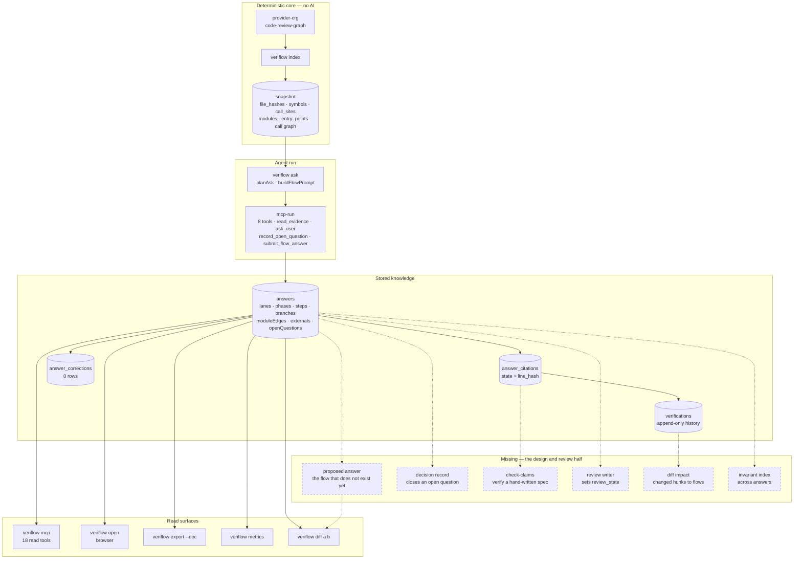
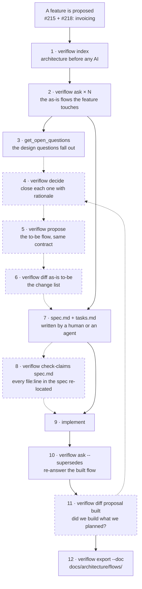
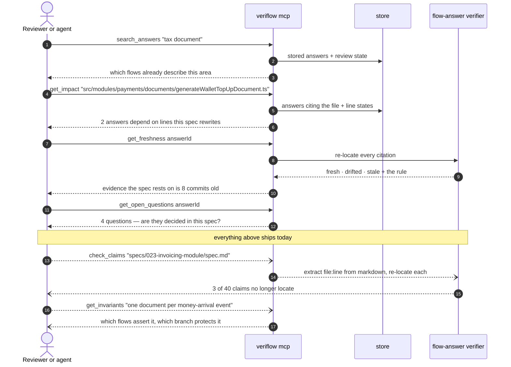
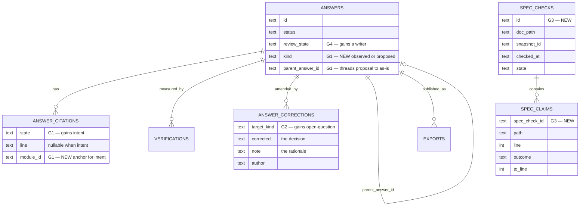
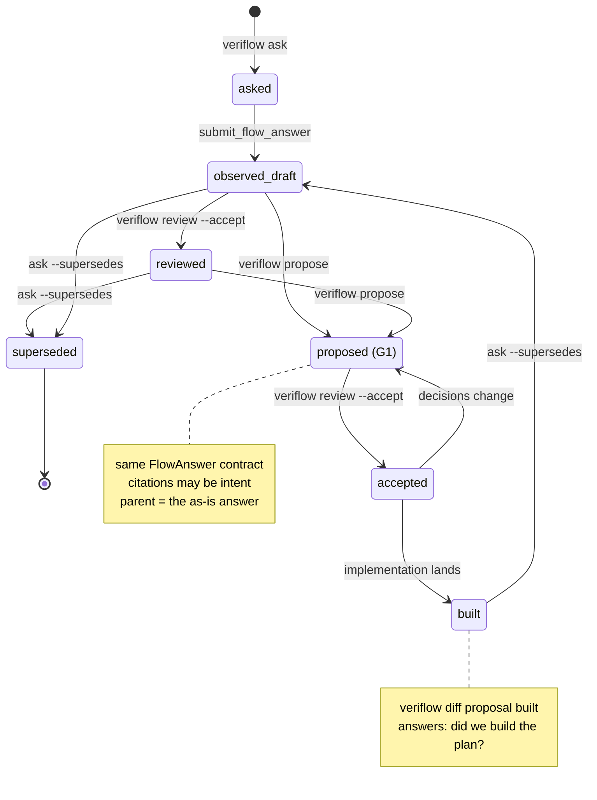

# Designing and reviewing a feature with VeriFlow

> **A proposal, not a roadmap commitment.** Nothing here is in `roadmap.yaml`. It is written
> against a real test case that has just been through the whole design cycle *without*
> VeriFlow, so the gaps are observed rather than imagined.

## 1. The test case

`main-panel` feature **023 — the invoicing module** (`specs/023-invoicing-module/`), which
consolidates GitHub issues #215 and #218 plus an architecture design doc into a spec and 61
tasks. It is a good stress test because it is not a leaf change:

- four near-duplicate document-generation pipelines collapse into one new module `src/modules/invoicing`;
- a settlement-time VAT snapshot is added to four write paths that today read live state at render time;
- `lesson_tax_documents` is renamed and four foreign keys flip from `CASCADE` to `SET NULL`/`RESTRICT`;
- a payment subscriber moves from the payments module up into the application layer, taking a
  tier gate with it;
- a new customer-facing SQL RPC lets a customer spend wallet credit, which no code path allows today.

Producing it took: reading two issues, one design doc and five memory records; a subagent sweep
of ~150k tokens to verify 22 claims about current code; and a hand-written review that found
**21 discrepancies** between what the sources asserted and what the code actually does.

VeriFlow was **already indexed on this repository the whole time** and was not used once.

## 2. What VeriFlow already knew

`main-panel/.veriflow/veriflow.db` — 125 MB, indexed at commit `5fc5be6` on
`feature/022-payment-integrity`, 1,676 files, 32,816 symbols, 95 modules, 212 doors,
6 stored answers, 1,055 citations, 9 verifications.

One of those six answers is titled *"Vyrovnání již existující rezervace z interního kreditu"*.
It was asked on 2026-07-31 — **the day before the 023 spec was written** — and it carries four
open questions. Every one of them is a decision the spec later made by hand, in a different
repository, with no link back:

| VeriFlow open question (2026-07-31) | Where it was decided (2026-08-02) |
|---|---|
| "Má být platba z interního kreditu zákaznický self-service tok? Repozitář dokládá pouze administrátorský `CustomerDetailDrawer` a instructor-only endpoint." | spec FR-D — yes, via a new RPC authorised on `wallet.user_id` |
| "Má být rezervace kapacity a stržení wallet kreditu jeden atomický use case?" | task T051 — yes, one RPC creates the booking and debits |
| "Má wallet refund zapisovat globální `payment_events`/refund outbox?" | task T052 — yes, `booking_paid` with `instrument: 'credit'` |
| "Jak operativně retryovat selhaný wallet refund po stornu?" | spec R14 — degrade to the manual path, never fail the dialog |

That answer also has the worst verification ratio of the six — **187 verified, 39 unverified**
(17%), against 0–6% for the others. That is not a defect. The question described a flow that
does not exist yet, so a sixth of its claims had nothing to cite. **An unverified spike is the
signature of a design question wearing a description question's clothes** — a signal VeriFlow
currently records and no surface reads.

Three more facts from the same database, each of which is a gap in disguise:

- all six answers are `status: draft`, `review_state: unreviewed` — nothing has ever been reviewed;
- `answer_corrections` has **0 rows** — the correction layer has never been written to;
- `parent_answer_id` is `NULL` on all six — no answer has ever been threaded to another.

And the practical one: `main-panel/.mcp.json` registers playwright and two Supabase servers.
It does **not** register `veriflow mcp`. During the 023 design session the stored answers were
not merely unused — they were invisible.

## 3. Architecture blocks

What exists today, and where the missing pieces would attach. Dashed = does not exist.

Everything on the left of `missing` is shipped. The six dashed boxes are the whole of what a
design-and-review loop needs on top, and four of them attach to tables that already exist.

## 4. The design loop

How 023 would have been produced with VeriFlow. Solid = works today, dashed = needs a gap closed.

Read the diagram as a claim about cost. Stages 1–3 and 9–12 are shipped and were skipped
anyway because the MCP server was not wired in. Stages 4–8 are where a spec is actually born,
and they are exactly the ones VeriFlow cannot hold.

Applied to 023, stage 2 is where the picture gets uncomfortable. The feature touches six flows;
the database contains two of them:

| Flow 023 changes | Stored answer? |
|---|---|
| Lesson paid → tax document issued | **no** |
| Wallet top-up → document issued | **no** |
| Refund → credit note (the proportional-vs-recomputed bug) | partly — two refund answers reach the credit note |
| Customer pays a booking from credit | yes — instructor-only variant, 39 unverified |
| Reconcile sweep issues missing documents | **no** |
| Tier gate on issuing | **no** |

The credit-note VAT bug — the single most valuable finding in the whole spec, where one code
path pro-rates the stored tax and its twin recomputes it from a live constant — sits in a flow
nobody has asked about. VeriFlow would not have found it *for* us; asking the question would
have put both call sites side by side in one answer, which is how the bug becomes obvious.

## 5. The review loop

Reviewing a spec is a different shape from reviewing a diff: the claims are prose, and the
question is whether they still hold. VeriFlow already stores everything needed to answer that.

The last two exchanges are the missing half. The first five are one `.mcp.json` entry away.

Note what the fifth step would have caught on 023: the spec cites
`generateLessonTaxDocument.ts:225` for an unescaped-HTML defect quoted from issue #218. The
defect was fixed in feature 022 and the citation now lands on the plaintext branch, two lines
above the escaped one. A human subagent caught it. `check-claims` would have caught it in
milliseconds, because the line hash no longer matches.

## 6. The six gaps

Each one states how it sits with the product's declared principles, because three of them
brush against explicit non-goals and pretending otherwise would be useless.

### G1 · A flow that does not exist yet has no unit

**What is missing.** Every stored artefact is anchored to a snapshot: `submit_flow_answer` runs
`verifyCitations` against real files, and a citation that cannot be read is `unverified`. A
planned flow has no files, so a proposal can only be expressed as an answer that fails its own
verifier — which is what the credit answer's 39 unverified citations actually are.

**Why it matters.** The 023 spec is nine tenths a to-be flow description: FR-D is a sequence
diagram in prose, with lanes, steps, branches and invariants. It is the FlowAnswer contract
written in Czech markdown, and nothing can check it, diff it or keep it fresh.

**Shape that fits.** Not a new model — a `kind` on `answers` (`observed` | `proposed`) and a
third citation state `intent`, carrying a module id and a planned path instead of a line. D1
survives ("the answer is the unit"); D12 survives ("verification labels, it does not gate" — an
intent is a label, not a failure). `parent_answer_id` already threads the proposal to the as-is
answer it modifies.

**Tension.** The roadmap's reserved item 3 is "declared intent / expected-vs-actual", and the
brief's non-goals ban "manually authored declared architecture and expected-vs-actual
enforcement". A proposal is the first half without the second: it declares intent for **one
flow**, from an answer that already exists, and enforces nothing. The enforcement is the diff
in G5, run once, by a human, after implementation.

### G2 · An open question cannot be closed

**What is missing.** `record_open_question` writes; nothing answers. `answer_corrections` has
the right shape (`target_kind`, `target_id`, `field`, `original`, `corrected`, `author`, `note`)
and **zero rows** — D13 deferred the editing surface, Q5 is still open about whether a
correction may add a step.

**Why it matters.** Four decisions that shaped a 61-task plan were recorded in a GitHub issue
comment, a spec file and an agent's memory. VeriFlow generated the questions and cannot show
that any of them were answered. Next quarter the open-question count on that answer will still
read 4.

**Shape that fits.** `veriflow decide <answerId> <questionId> --decision … --rationale … --author …`,
writing a correction row with `target_kind: "open-question"`. A human CLI action, not an MCP
write tool — "approval is a boundary in code" stays intact. Q5 does not block it: closing a
question amends nothing.

### G3 · A hand-written spec cannot be checked — the cheapest win here

**What is missing.** `verifyCitations` + `locate()` + `line_hash` + the 120-line drift window
already do exactly the job, and only run over agent-submitted answers.

**Why it matters.** The 023 spec makes roughly 40 claims of the form `file.ts:123`. Verifying
them cost a 150k-token subagent sweep and found 21 discrepancies — stale line numbers, a
column the design doc proposed that already exists, a `document_kind` said to be unchanged that
already has four values, a bug quoted from an issue that was fixed two commits earlier. That is
one afternoon of one feature. Every issue, ADR and design doc in the repository has the same
rot and no instrument.

**Shape that fits.** `veriflow check-claims <path.md>` — extract `file:line` from markdown, run
the existing verifier, print `resolved | drifted | missing | file-missing` with the same ladder
and the same window. It writes nothing to the document. It is also a direct answer to the
still-open **Q12**, which already names `specs/` as a candidate import format.

### G4 · The review state has no writer

**What is missing.** Every MCP envelope leads with `review: unreviewed | reviewed` (D17), the
browser shows it, `Store.setReviewState` exists — and no command or route calls it. Only tests do.

**Why it matters.** The loop cannot close. Six answers describe the payment core of a
production marketplace and every one is permanently a draft, which makes the label carry no
information at the exact moment an agent is deciding how much to trust it.

**Shape that fits.** `veriflow review <answerId> --accept|--reopen [--note]`, plus a button in
the browser. Small, and it makes G2's decisions visible where the agent already looks.

### G5 · Impact is per file, not per change

**What is missing.** `get_impact(path)` answers "which answers cite this file" — the roadmap's
own reserved item 5 notes that mapping a changed **hunk** onto the flows it lands in is what is
still missing.

**Why it matters.** 023 renames a table, flips four foreign keys and moves a subscriber between
layers. All six stored answers cite files it rewrites; two are already `stale` after eight
commits. Nobody will notice until someone reopens an answer and reads a description of code
that no longer exists.

**Shape that fits.** Two commands over machinery that exists: `veriflow impact --diff <ref>`
(hunks → cited lines → affected answers, no agent) and, once G1 lands, `veriflow diff <proposal>
<built>` — which is `diffAnswers` unchanged, given a proposal as the left-hand side. That is the
question a plan exists to answer: *did we build what we planned?*

### G6 · Invariants have no home above one answer

**What is missing.** `branches[].invariant` is per branch, inside one answer. Nothing indexes
invariants across answers.

**Why it matters.** 023's real content is four cross-flow rules: one document per money-arrival
event, never per booking; corrections derive tax proportionally and never recompute it; the free
tier must never burn a document number; a wallet holds exactly one tax regime. Each is asserted
in several flows and can be broken in any of them. The repository has the same idea already —
`main-panel/docs/architecture/invariants.md`, hand-written, `status: draft`, last reviewed three
weeks ago.

**Shape that fits.** Read-only to start: `get_invariants` returning invariant text → the
answers and branches asserting it, plus each one's freshness. That is an index over stored
strings, not a rule engine, and it stops short of the health-score and findings machinery the
brief rules out. Whether it ever gains a checker is a separate decision, and the brief's
"disagreement beats a single score" argues it should not gain a score.

## 7. Schema delta

Deliberately small — three of the six gaps need no new table.

`SPEC_CHECKS` / `SPEC_CLAIMS` mirror `verifications` / `verification_results` exactly, because
they are the same measurement pointed at a different subject. The schema has no migration
system (`SCHEMA_VERSION = 1`, a single DDL string that throws on mismatch), so whichever of
these lands first should bring one with it.

## 8. Lifecycle

The loop closes at `built → observed_draft`: a proposal, once implemented, is re-asked and
becomes an ordinary answer whose evidence verifies. Nothing about the proposal is special after
that except the diff it leaves behind.

## 9. What to build first

| Order | Gap | Why first | Rough cost |
|---|---|---|---|
| 1 | **wire `veriflow mcp` into the target repo** | not a feature — one `.mcp.json` entry; without it none of the shipped surface is reachable from the session doing the design | minutes |
| 2 | **G3 check-claims** | highest value per line: the verifier exists, it answers open Q12, and it pays off on every existing spec, issue and ADR immediately | small |
| 3 | **G4 review writer** | closes the loop that the whole MCP envelope already advertises | small |
| 4 | **G2 decide** | makes the open questions VeriFlow already generates into an asset rather than a permanently open list | small |
| 5 | **G1 proposals** | the real feature; needs a schema version and a considered `intent` contract | medium |
| 6 | **G5 diff impact / plan-vs-built** | mostly reuse of `diffAnswers` once G1 exists | medium |
| 7 | **G6 invariant index** | valuable but the most likely to drift toward the banned findings engine; do it last, read-only | medium |

## 10. What this proposal deliberately does not ask for

- **No health score, no findings engine, no architecture timeline, no PR bot.** All are named
  non-goals, and "disagreement beats a single score" is the better position.
- **No architecture write tools over MCP.** G2 and G4 are CLI verbs a human runs. The agent may
  read a decision; it may not record one.
- **No expected-vs-actual enforcement.** G1 declares intent for one flow and checks it once,
  after the fact, with a diff a human reads. There is no rule file, no gate, no CI.
- **No manually authored architecture model.** A proposal is derived from an answer that was
  itself derived from the index. Nobody starts by drawing boxes.

## 11. One number worth keeping

The credit-payment answer: **187 verified, 39 unverified, 4 open questions**. It was the most
"broken" answer in the database and the most useful one — because the unverified sixth and the
four questions *were the design work*, surfaced a day early, and nothing in the product could
tell anyone that. Reading an unverified spike as a design signal rather than a quality problem
is, on its own, most of the idea in this document.
