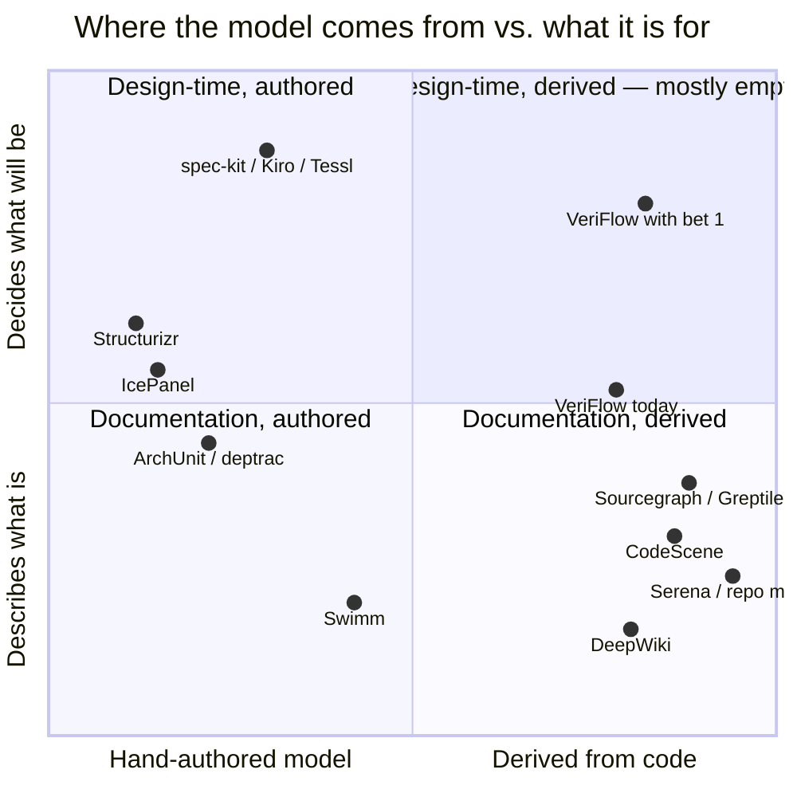

# Where VeriFlow goes after M6

> **Exploration with a promoted core.** F023–F024 are shipped; the graphical overlay, source
> adapters, agent handoff and question queue remain implementation-ready F025–F028 in `roadmap.yaml`.
> Their detailed contract is
> [m7-plan-overlay-plan.md](m7-plan-overlay-plan.md). Token economics and decision tooling remain
> candidates. This document records the wider reasoning against the code as it stands after M6 on
> 2026-08-04 (F001–F022 shipped).

## 0 · The five bets, in one page

| # | Bet | The call | Rests on code that exists |
|---|---|---|---|
| 1 | **The plan overlay.** An agent's plan — Claude Code plan mode, spec-kit `plan.md`, Kiro `design.md` — is drawn against the indexed architecture *before* a line is written. | Build it. This is the wedge, and nobody else has it. | `claims.ts`, `intent.ts`, `diff-impact.ts`, `buildFlowOverlay` |
| 2 | **Token economics as a measured property**, not a side effect. Every response says what it replaced; a context pack collapses the 6-call ritual into one. | Build it, and put the number on the box. | `read-server.ts` byte budget, `text.ts` |
| 3 | **From describing to deciding.** Two proposals, one comparison matrix; decisions that carry a freshness state. | Build the options matrix. It is mostly `diffAnswers` twice. | `answer-diff.ts`, `decide.ts` |
| 4 | **Kill the cold start.** VeriFlow only pays after somebody asks. Turn the architecture into a *question queue* so it tells you what to ask. | Build the queue. Do not bulk-generate answers. | `project.ts` unreached modules, `entrypoints` |
| 5 | **Distribution.** In the one real dogfooding session, `veriflow mcp` was not registered and the six stored answers were invisible. | Fix this first. It is an afternoon and it gates everything else. | `veriflow-for-agents.md` install steps |

Bet 1 is the user-visible feature. Bet 5 is the one that decides whether any of the others are ever
seen.

---

## 1 · Where VeriFlow actually stands

All twenty-two M1–M6 features shipped. What that adds up to, honestly:

**Deterministic core.** `index` produces the module registry, entry points and call graph with no AI
involved. That is a genuinely unusual starting point — most tools in this space either hand-author
the model or ask an LLM to invent it.

**The answer as the unit.** One question → one stored answer with lanes, phases, steps, branches,
module contracts, externals, and a `file:line` behind every claim, each labelled `verified` /
`unverified` / `open-question` / `intent`. Immutable, corrections kept separately.

**Drift that is computed, not asserted.** Freshness is measured by hashing cited files and
re-locating citations through a 120-line window, not by counting commits. Four states with a rule
each, and `broken` deliberately reserved for "the way in is gone" rather than "a file is gone".

**Twenty-two read tools over MCP**, every response wrapped in the same envelope — snapshot,
freshness, review state — with no opt-out, enforced by a test.

**The design half, shipped in M5.** `check-claims` re-locates `file:line` claims in hand-written
markdown. `impact --diff <ref>` maps changed hunks onto cited lines. `propose` produces a second
answer with `intent` citations and proposed modules. `diff a b` compares two answers.
`buildFlowOverlay` draws the change onto the observed diagram. `review` and `decide` close the loop.

### The three uncomfortable facts

Taken from `design-and-review-loop.md` §2, still true:

1. **It was indexed on `main-panel` the whole time and was not used once** during the 023 design
   session — because `.mcp.json` did not register it.
2. **All six stored answers are `unreviewed`, `answer_corrections` has zero rows.** Every write path
   in the review loop exists and has never been exercised outside tests.
3. **The most valuable finding in the 023 spec — the credit-note VAT bug — sat in a flow nobody had
   asked about.** VeriFlow could not have found it, because nothing in the product says *"you should
   ask about this"*.

Fact 1 is bet 5. Fact 3 is bet 4. F021 has now shipped the UI needed to change fact 2 through normal
review work rather than direct database or CLI operations.

---

## 2 · The competitive map

Four camps, none of which occupies the same square.



| Tool | What it models | Model comes from | Drift handling | Evidence per claim | Serves agents | Compares a *plan* to code |
|---|---|---|---|---|---|---|
| [Serena](https://github.com/oraios/serena) | symbols, via LSP | derived, live | n/a — always live | n/a | yes, MCP | **no** |
| aider repo map / native agent search | file + symbol map | derived, live | n/a | no | implicit | **no** |
| [DeepWiki](https://www.everydev.ai/tools/deepwiki) | a prose wiki | LLM-generated | scheduled re-index | weak | yes | **no** |
| [Swimm](https://swimm.io/blog/how-we-automatically-generate-documentation-for-legacy-code) | docs coupled to code tokens | human + assisted | Auto-sync, token-level | yes, token-level | partial | **no** |
| [Structurizr](https://structurizr.com/) | C4 model | hand-authored DSL | agent compares model↔code | no | no | model, not plan |
| [IcePanel](https://icepanel.io/blog/2025-11-14-icepanel-vs-structurizr) | C4 model | hand-drawn | git integration | no | no | model, not plan |
| ArchUnit / deptrac / dependency-cruiser | static rules | hand-written rules | CI gate | n/a | no | **no** |
| CodeScene | behavioural hotspots | derived from git history | live | no | partial | **no** |
| Sourcegraph / Greptile / Qodo | search + PR context | derived | live | no | yes | at PR time, after the code exists |
| [spec-kit](https://github.com/github/spec-kit) / [Kiro](https://www.marktechpost.com/2026/05/08/9-best-ai-tools-for-spec-driven-development-in-2026-kiro-bmad-gsd-and-more-compare/) / [Tessl](https://tessl.io/blog/tessl-launches-spec-driven-framework-and-registry/) | specs as source | human + agent authored | **none — specs rot silently** | no | yes | **no** |
| **VeriFlow** | flows, modules, invariants | derived, then agent-narrated | hash + re-locate, four states | **yes, per claim, with a state** | yes, 22 tools | **the only one that can** |

### Read the last two rows together

The spec-driven camp is the fastest-growing workflow in the market — spec-kit alone lists 29 agent
integrations, and the loop is always `spec.md → plan.md → tasks.md → code`. Every one of those files
makes assertions about code that already exists, and **not one of those tools has an instrument to
check them.** The 023 case measured what that costs: a 150k-token subagent sweep, 21 discrepancies
found by hand, in one afternoon, on one feature.

VeriFlow's `check-claims` does the checkable part of that in milliseconds and already ships. What it
does not yet do is the part the user asked about: draw the plan against the architecture so a person
can see what the change lands on.

### The defensible slot

> Serena makes an agent read *less*. DeepWiki makes a repo *readable*. Swimm keeps a doc *honest*.
> Structurizr keeps a *drawing* honest. Nobody keeps a **plan** honest against an evidence-backed
> model of the code, before the code is written.

That is one sentence, it is true today, and it is where the remaining work should point.

---

## 3 · Bet 1 — the plan overlay

**The user's idea, stated back:** when Claude Code or spec-kit produces a plan, VeriFlow shows it
drawn against what the codebase is now, so a programmer can see how the change will land.

VeriFlow is roughly 80% of the way there and does not know it. What exists:

| Piece | Where | What it already does |
|---|---|---|
| claim extraction from markdown | `packages/answers/src/claims.ts` | pulls `path:line` out of prose, re-locates each against the tree, reports `resolved`/`drifted`/`missing`/`file-missing`/`unanchored` |
| intent citations | `packages/flow-answer/src/intent.ts` | a citation with no line, anchored to a module id or a planned path |
| proposed modules | `intent.ts` `proposedModulesOf` | assembles the modules a proposal would add, and flags which do not exist in the registry |
| the overlay renderer | `packages/diagram/src/index.ts` `buildFlowOverlay` | added / removed / moved lanes and steps drawn on the observed diagram |
| hunk → cited line | `packages/answers/src/diff-impact.ts` | which stored flows a change lands in, by exact line |
| answer diff | `packages/answers/src/answer-diff.ts` | proposal vs. observed vs. built |

What is missing is a stored plan artifact, one bounded translation adapter and one screen. Today the only way to get a proposal is
`veriflow propose <answerId> "<change>"` (`apps/cli/src/main.ts:908`), which **runs a full agent
session**. That is the wrong entry point for this use case, because the plan already exists — the
agent already did the thinking, in a different window, and threw the result away.

### Two levels of fidelity, and the important one is the cheap one

**Level 1 — deterministic, no AI, sub-second.** `veriflow plan <path.md>`:

1. extract every `path:line` claim and every bare path (`claims.ts`, widened to accept paths without
   a line — a plan says *"create `src/modules/invoicing/issue.ts`"* far more often than it cites a
   line);
2. partition them: **exists and locates** / **exists and drifted** / **exists and gone** / **does not
   exist → planned**;
3. map the existing side onto the module registry, and the planned side onto proposed modules by
   path prefix, exactly as `intentModuleOf` already does;
4. run the existing-path set through `diff-impact` against stored answers → which flows this plan
   lands in, and **which exact cited lines**;
5. report the four numbers that matter.

```text
$ veriflow plan specs/023-invoicing-module/plan.md

  40 claims · 31 locate · 3 drifted · 3 missing · 3 unanchored
  planned: 7 new files in 1 module that does not exist yet  (src/modules/invoicing)

  lands in 2 stored flows
    a1b3c9  Vyrovnání rezervace z interního kreditu      DRIFTED   9 cited lines touched
    77f210  Refundace lekce                              FRESH     4 cited lines touched

  enters 3 modules no answer reaches
    src/modules/payments/documents      · 0 answers   ← the credit-note VAT bug lives here
    src/modules/billing/tiers           · 0 answers
    src/lib/pdf                         · 0 answers

  3 claims no longer locate — the plan is quoting code that moved
    plan.md:88   generateLessonTaxDocument.ts:225   → now line 223, plaintext branch (fixed in 022)
```

That output costs nothing, needs no model, and would have caught the single defect the 023 review
found by hand. **Level 1 is the deterministic foundation, not the M7 product outcome.** It may ship
and pay off first, but the milestone is not complete until a person can review the drawing.

**Level 2 — the drawing.** With a parent answer named, hand the plan to one short agent run whose
only job is to translate it into the `FlowAnswer` contract with `intent` citations — no exploration,
no evidence sweep, because the plan is the input and the tree is already indexed. That yields a
proposal answer, and `buildFlowOverlay` draws it. This is `propose` with a document instead of a
sentence, and it is a strictly smaller run than the one that exists.

### The adapter protocol

Mirror F002's decision — one protocol, replaceable adapters — because the plan format market is
fragmenting fast and none of them will win outright:

| Adapter | Source | Notes |
|---|---|---|
| `markdown` | any `.md` | the general case; spec-kit `plan.md`/`tasks.md` and Kiro `design.md` are this |
| `claude-code` | `~/.claude/projects/<slug>/*.jsonl` | **verified: plan-mode plans are in the local transcript** as `ExitPlanMode` tool inputs, keyed by cwd. No API, no network, no permission — it is a local file |
| `speckit` | `specs/NNN-*/` | reads `spec.md` + `plan.md` + `tasks.md` as one unit, so `[P]` parallel markers and per-task file paths come through structured |
| `git-branch` | a diff against a base ref | already exists as `impact --diff`; make it a plan source so the same screen serves before *and* after |

### The screen

The overlay renderer exists; the browser needs a route. `apps/server/src/index.ts` has `/impact`
and `/architecture/compare` already — `/plan/:id` sits beside them and reuses both renderers:

- **top**: the flow overlay — observed steps solid, added steps dashed, removed steps struck, moved
  steps annotated with where they went;
- **middle**: the module map with planned modules dashed and the touched observed modules lit;
- **bottom**: the claim ledger — every `file:line` in the plan with its outcome and, where it moved,
  the line it moved to.

Then `veriflow export --plan` writes it as one self-contained HTML or a mermaid-carrying markdown,
which is the artifact that gets pasted into a PR or a Slack thread. This matters more than it
sounds: the overlay's value is mostly in being *shown to somebody else*.

### The hook — where this becomes automatic

Claude Code fires hooks on tool use. A `PostToolUse` hook matching `ExitPlanMode` that runs
`veriflow plan --from-transcript` turns the whole thing into: *you approve a plan, and the impact
appears without asking.* That is the moment the product stops being a thing you remember to use.

Ship it as `veriflow install-agent`, which writes the `.mcp.json` entry, the hook, and the skill in
one command — see bet 5.

---

## 4 · Bet 2 — token economics, measured

VeriFlow's honest pitch to an agent is *"stop reading the repository"*, and it already has the one
measurement that proves it: `other: 0` in the `veriflow-for-agents.md` table — the agent never fell
back to a file read. That number is buried in a doc and produced by a hand-run script. Four moves
turn it into a product property.

### 4.1 · The receipt

Add `cost` to every MCP envelope:

```jsonc
"cost": {
  "bytesReturned": 18422,
  "estimatedTokens": 4600,
  "citedSource": { "files": 14, "bytes": 210344, "estimatedTokens": 52586 },
  "note": "the source this response cites, which an agent without VeriFlow would locate and read"
}
```

The wording is doing real work. It does **not** claim the agent would have read all 210 KB — it
says what the response stands in for, which is checkable, and leaves the inference to the reader.
That is the same discipline as `scope: answer-citations` and `source: estimate`, and it is why this
number will survive contact with a sceptic when a marketing figure would not.

### 4.2 · The context pack — collapse the ritual

`veriflow-for-agents.md` documents a six-call design ritual and a six-call review ritual. In an
agent loop every extra round trip re-sends the entire conversation; ten calls is not ten times the
payload, it is ten prefills. One tool:

```
get_context_pack({ paths: [...], or task: "…" })
  → modules touched · flows citing them, with the exact cited lines
  → invariants those flows assert · open questions already known
  → freshness per answer · coverage gaps · what has no answer at all
```

budgeted by the same `BYTE_BUDGET` (`read-server.ts:59`), with `truncated` naming the tool that
serves each omitted section in full. Two calls instead of ten, and the second one only if the first
says something interesting.

### 4.3 · Text, not JSON

JSON envelopes are expensive per unit of meaning. A `format: "text"` option rendering the same data
as dense fixed-width sections — `packages/diagram/src/text.ts` already does this kind of layout —
should cut 40–60% off large responses. Keep JSON as the default for machine consumers; let the
agent ask for text.

### 4.4 · The cheapest tokens are negative ones

`get_project_overview` already reports modules **no answer reaches**. That is the highest-value byte
in the whole surface, because it converts an open-ended search into a bounded one: *nothing stored
vouches for this module — either ask, or read it yourself, and say which you did.* Promote it from a
field to a headline, and make `get_impact`'s empty result say the same thing in the same words. The
doc already warns that an empty impact means "nobody asked", not "nothing depends on it" — the
response itself should carry that sentence, not the manual.

### 4.5 · Make the benchmark a command

`artifacts/demo-mcp-agent.mjs` is the harness. Promote it: `veriflow bench` runs the design and
review questions against a registered client, with and without VeriFlow, and prints wall clock,
tool calls, `other:` count, and total tokens. Run it in CI on the dogfooding target. **The number
that sells this product is a number this product can measure about itself.**

---

## 5 · Bet 3 — from describing to deciding

VeriFlow describes very well. It does not yet help anyone *choose*. Three additions, all reuse.

### 5.1 · The options matrix — the highest-value feature in this document

An architecture decision is a choice among designs. VeriFlow can already produce a proposal from an
observed flow and diff two answers. So:

```
veriflow options <answerId> "collapse the four pipelines into one module" \
                            "keep four pipelines, extract the shared VAT snapshot"
```

runs one short proposal per option and prints a comparison — not a score, a table of consequences:

| | option A · one module | option B · shared snapshot |
|---|---|---|
| modules added | 1 (`src/modules/invoicing`) | 0 |
| modules touched | 7 | 4 |
| standing flows whose cited lines move | 4 | 2 |
| invariants crossed | 3 | 1 |
| alternative outcomes changed | 6 | 2 |
| outcomes entering a module no answer reaches | 3 | 1 |
| open questions the option leaves open | 2 | 4 |

This is `propose` × N + `diffAnswers` × N + counting, and it is the difference between an
architecture *documentation* tool and an architecture *decision* tool. It also stays inside the
brief's rules: no grade, no winner, disagreement visible. The columns are consequences; the choice
stays with the person.

### 5.2 · Decisions with a freshness state

`veriflow decide` closes an open question on one answer. Widen the same record to a project-level
decision — an ADR — that names the modules, flows and invariants it rests on. Then a decision
inherits a freshness state from its evidence, and `veriflow decisions` can say *"D7 rests on a flow
that is now `stale`"*. Structurizr has decision records; none of them can go stale on their own.

### 5.3 · Exposure, not health

Per module: how many standing flows cross it, how many invariants are asserted through it, how many
open questions sit in it. Rank the list. Call it **exposure**, count it with an honest denominator
(*"over the 9 flows anyone has asked about"*), and never combine the columns. The brief bans a
health score and it is right to — but "which modules are expensive to change, and how much of that
do we actually know" is the question a tech lead opens the tool with.

---

## 6 · Bet 4 — kill the cold start

VeriFlow pays only after somebody asks a good question. Nothing in the product suggests what to ask.
That is why the credit-note VAT bug sat unfound in a flow nobody had opened.

**Build the question queue.** From data that already exists:

- modules with no answer, ranked by call-graph traffic — *"the busiest thing nobody has asked
  about"*;
- entry points with no answer — `veriflow entrypoints` already ranks them;
- **an unverified spike** — `design-and-review-loop.md` §11 nails this: an answer that is 17%
  unverified against a 0–6% baseline is a design question wearing a description question's clothes.
  Surface it as `designSignal` on the answer, not as a quality defect;
- modules a *plan* touches that no answer reaches — bet 1 produces exactly this list;
- flows whose invariants are asserted in more than one answer with different wording — a
  disagreement worth resolving.

Then `veriflow ask --next` takes the top of the queue. The queue is the onboarding path, the
dogfooding path, and the answer to *"I opened it and there was nothing in it"*.

**Do not bulk-generate answers.** Auto-seeding N answers overnight would fill the database with
`unreviewed` agent prose and destroy the one property the product rests on. A queue proposes; a
person spends the run.

---

## 7 · Bet 5 — distribution, which gates everything above

The single largest finding in this repository is that VeriFlow was indexed, loaded, and invisible.
Registration is four lines of JSON that nobody wrote.

`veriflow install-agent [--client claude-code|codex] [project]` should write, idempotently, with a
diff shown before each write:

1. the `.mcp.json` / `~/.codex/config.toml` entry — the exact command from
   `veriflow-for-agents.md`, with the `cwd` trap already handled (started from the wrong directory
   the server exits and the agent silently sees no tools — that failure mode should be impossible
   to configure into);
2. `.claude/skills/veriflow/SKILL.md` — when to reach for which tool, the design ritual, the review
   ritual, and the two sentences about what an empty result means. **A skill is cheaper than tool
   discovery**: it is read once from disk rather than re-derived per session;
3. the `ExitPlanMode` hook from bet 1;
4. a `CLAUDE.md` fragment carrying the static architecture digest — module count, the top modules by
   traffic, the flows that have answers — so a session starts oriented at zero tool calls.

Then `veriflow doctor` gains a line: *"agent integration: registered / not registered"*. Today
doctor checks the provider and the client binaries but not the one thing that made the whole product
invisible in its only real trial.

---

## 8 · What not to build

Stated plainly, because three of these will be tempting once bet 1 lands.

- **No findings engine, no health score, no architecture grade.** Banned by the brief, and
  "disagreement beats a single score" is the stronger position. The options matrix is columns, not a
  winner.
- **No CI gate.** `veriflow verify --exit-code` for somebody who chooses to wire it is fine — an
  exit code is not a bot. Blocking a PR on a freshness state is not, and it would make the label a
  thing people route around instead of read.
- **No multi-repo.** Backstage, IcePanel and Compass own the catalog square and it is a different
  product with a different buyer. Stay single-repo until the plan overlay is loved by somebody.
- **No hosted anything, no VeriFlow-managed model.** Local-first and BYO-agent is the differentiator
  against DeepWiki and Swimm, not a limitation to grow out of.
- **No enforcement of declared architecture.** F018 compares; that is the correct stopping point.

### The one dependency risk worth naming

Everything rests on `code-review-graph`, one external Python CLI, for symbol and call resolution.
The dogfooding target is TypeScript, the agent ecosystem is TypeScript, and the market's sharpest
token-efficiency tool ([Serena](https://github.com/oraios/serena)) gets its accuracy from LSP rather
than a bespoke parser. **Reconsider the first-party indexer as an LSP adapter rather than a written
parser** — `tsserver` gives exact resolution for free and the F002 protocol was designed for exactly
this substitution. It is roadmap candidate #1 already; the argument for promoting it is that it is
also the cheapest path to the languages VeriFlow currently cannot see.

---

## 9 · Promotion and remaining sequence

| Order | Candidate | Why here | Cost | Value |
|---|---|---|---|---|
| 1 | **F023 · `veriflow plan <doc>` — deterministic intake** | Establishes the plan artifact and maps its claims onto current modules and flows without AI. | small | **highest** |
| 2 | **F024 · plan → proposal translation** | Supplies the structured lanes and steps the existing overlay renderer needs, through a deliberately bounded run. | medium | high |
| 3 | **F025 · graphical plan screen + `export --plan`** | The primary future feature: the artifact a person sees and shares before code is written. | medium | **highest** |
| 4 | **F026 · plan-source adapter protocol** (`markdown`, `claude-code`, `speckit`, `git-branch`) | Generalises input only after one Markdown path works end to end. | small | high |
| 5 | **F027 · `install-agent` + approved-plan handoff** | Makes the F025 outcome automatic where the client exposes a stable hook and visibly manual elsewhere. | small | unlocks adoption |
| 6 | **F028 · the question queue** | Fixes cold start after the graphical plan path exists; converts uncovered plan areas into explicit next questions. | small | high |
| 7 | **candidate · context pack + `cost` receipt** | Makes the token claim measurable and the surface cheaper without delaying the plan overlay. | small | high |
| 8 | **candidate · options matrix** | The decision tool. It depends on cheap proposals-from-documents and should follow real use of the plan screen. | medium | high, later |
| 9 | **candidate · decisions with freshness / exposure** | Valuable and the most likely to drift toward the banned score; keep it last and read-only. | medium | medium |

F022 has shipped independently; none of the above depends on it. F021's correction UI gives ordinary
review work the path that writes attributed rows to `answer_corrections`, while F022 makes follow-ups,
replacements and proposals explicit and navigable without changing their immutable answers.

---

## 10 · Promoted decisions and remaining guardrails

1. **Does `veriflow plan` write to the database?** A plan check is a measurement like `check-claims`,
   which writes nothing. But a plan screen needs a stable artifact that can be reopened. F012 did not
   create `SPEC_CHECKS`/`SPEC_CLAIMS`; persisting into them is not available.
   *Promoted decision:* the default stays read-only and `--save` explicitly creates an idempotent,
   fingerprinted plan artifact in the F023 store contract.
2. **Is reading `~/.claude/projects/*.jsonl` acceptable?** It is a local file the user owns, no
   network, no API. But it is another program's private state and its format can change.
   *Promoted decision:* yes, behind an adapter that degrades to "no plan found" rather than crashing,
   and never as the default source — the default is a path the user names.
3. **Does level 2 justify an agent run at all,** or should the plan-to-proposal translation be
   deterministic-but-shallow (paths and modules only, no lanes or steps)? *Promoted decision:* yes,
   because the graphical plan is the M7 outcome. F024 is a bounded translator over the saved plan,
   observed parent and module registry — not a repository-exploring second `ask`.
4. **Where does the options matrix stop?** Two options is a comparison; five is a leaderboard, which
   is the banned score wearing a table's clothes. *Recommendation:* cap at three, and print the
   consequences with no ordering.
5. **Does `cost` risk overclaiming?** It is the strongest number the product has and the easiest to
   turn into a lie. *Recommendation:* the field name is `citedSource`, never `saved`, and the note
   ships with it.

---

## 11 · One paragraph, if only one survives

VeriFlow has spent six milestones making a codebase's behaviour observable, cited and drift-aware,
and it is good at it. The market has meanwhile filled up with tools that generate *plans* —
spec-kit, Kiro, Tessl, every agent's plan mode — and not one of them can check a plan against the
code it claims to change. VeriFlow already has the extractor, the intent citation, the proposed
module, the hunk-to-line mapper and the overlay renderer. The promoted work is a stable plan
artifact, a bounded translation, the graphical review screen and an installation path that delivers
an approved agent plan to it.

**Sources:** [Serena](https://github.com/oraios/serena) ·
[spec-kit](https://github.com/github/spec-kit/blob/main/spec-driven.md) ·
[Tessl](https://tessl.io/blog/tessl-launches-spec-driven-framework-and-registry/) ·
[SDD tool comparison](https://www.martinfowler.com/articles/exploring-gen-ai/sdd-3-tools.html) ·
[Swimm](https://swimm.io/blog/how-we-automatically-generate-documentation-for-legacy-code) ·
[DeepWiki](https://www.everydev.ai/tools/deepwiki) ·
[IcePanel vs Structurizr](https://icepanel.io/blog/2025-11-14-icepanel-vs-structurizr) ·
[Structurizr as-code](https://docs.structurizr.com/as-code)
